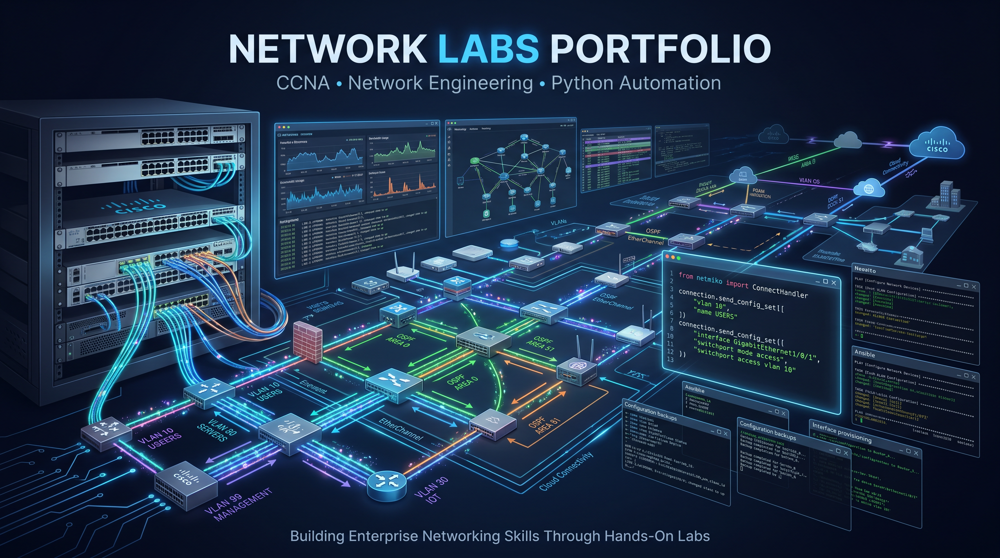

# 🌐 Network Labs Portfolio


Welcome to my **Network Engineering Lab Repository**.
This repository contains a collection of **hands-on networking labs and automation projects** that I am building as part of my journey toward becoming a professional Network Engineer.

The labs are designed to reinforce concepts from **CCNA-level networking**, while also extending into **network automation, monitoring, and real-world operational scenarios**.

---

## 🎯 Objectives

* Strengthen core networking fundamentals (VLANs, routing, switching, security, wireless services)
* Build practical, hands-on lab experience
* Develop network automation skills using Python
* Simulate real-world enterprise network scenarios
* Build simple networking tools 

---

## 📂 Repository Structure

```
network-labs/
│
├── packet-tracer/
│   ├── <project-folder>/
|   |   ├── Network-topology
│   │   ├── project.pkt 
│   │   └── README.md
│
├── Network-automation/  
│   ├── <project-folder>/
|   |   ├── Network-topology
│   │   ├── scripts/
│   │   ├── configs/
│   │   └── README.md
│
└── README.md
```

---

## 🧪 Lab Categories

### 🔹 Packet Tracer Labs

These labs focus on **core networking concepts** using Cisco Packet Tracer:

* VLANs & Inter-VLAN Routing
* STP & EtherChannel
* Dynamic Routing (OSPF, EIGRP, BGP)
* Network Services (DHCP, DNS, NAT)
* Network Design & Troubleshooting

---

### 🔹 Network Automation

These projects focus on **network engineering automation tasks** using Python:

* Automated device configuration
* Network monitoring scripts
* Configuration backup & restore
* VLAN and interface provisioning
* Infrastructure automation using Netmiko/Paramiko

---

## 📘 Documentation Approach

Each project includes its own `README.md` with:

* 📌 Project Overview
* 🧩 Network Topology
* ⚙️ Configuration Steps (if necessary)
* 🧪 Verification & Testing
* 📊 Key Learnings 

---

## 🚀 Ongoing Development

This repository is continuously updated as I:

* Add new labs
* Improve existing designs
* Explore advanced networking topics
* Expand into automation and DevNet concepts

---

## 🛠️ Tools & Technologies

* Cisco Packet Tracer
* GNS3
* Cisco IOS
* Python (Netmiko, Paramiko)
* Wireshark (for analysis where applicable)

---

## 📈 Future Plans

* Implement multi-area OSPF and BGP labs
* Integrate Ansible for automation
* Build network monitoring dashboards
* Simulate enterprise-scale topologies

---

## 🤝 Contributions

This is a personal learning repository, but suggestions and feedback are always welcome.

---

## 📬 Contact

Feel free to connect with me for collaboration or discussion on networking topics.

Linkedin: *[Hillary](https://www.linkedin.com/in/hillary-mapondera-7825b91a1/)*

---

⭐ If you find this repository useful, interesting or simply want to colaborate, feel free to star it or connect with me!
