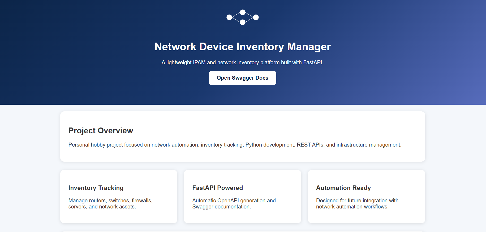

**Network-source-of-truth**

🎯 **Objective**

Build an application that stores and manages network devices (Device Inventory Manager).

**This project involves:**
- IP addressing
- Device management
- REST APIs
- Databases
- CRUD operations

| Technology Stack | Framework |
| :--- | :--- |
| Backend | <ul><li>FastAPI</li><li>Pydantic</li><li>SQLAlchemy</li></ul> |
| Frontend | <ul><li>(None Initially)</li>|
| Database | <ul><li>SQLite</li> |
| Networking library | None Initially |

---

### Features

Store:
- Hostname
- Management IP
- Subnet
- Device Type
  - Router
  - Switch
  - Firewall
- Location
- Vendor
- user name
- Console login local password (Encrypted)
- Preveledge exec mode password (Encrypted)
- Notes

Functions and features:

- Add device
- Edit device
- Delete device
- Search device
- Filter by subnet
- Automatic data validation (including subnets and IP validatation)

**Server Response**

### Networking Knowledge Applied

The project involve working with:

- IPv4 addressing
- Subnet planning
- Device roles
- Network documentation
