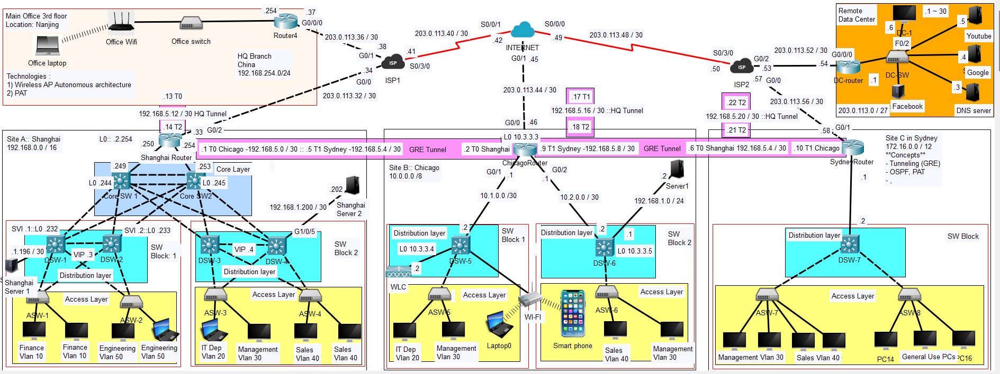

# 🚀 Multi-Site Enterprise Network Project

## Overview
This project simulates enterprise environment with one headquarters branch and three sites: Shanghai, Chicago, and Sydney. The headquarters serves as the management hub, where network engineers can remotely manage all network devices across the network using SSH.

Each site is connected through a wide area network with Internet service providers for Internet access. I’ve also built a data center hosting servers for Google, Facebook, YouTube, and DNS. EIGRP is configured as the dynamic routing protocol between the routers on the WAN. Each site uses private IP address range, thus GRE tunnels have been built between the branches and the headquarters, allowing them to securely communicate over the Internet. Inside each site, as well as across the tunnels, OSPF handles dynamic routing for all private networks.

Port Address Translation has been configured allowing multiple private hosts share a single public IP for outbound Internet access. For redundancy, HSRP on the multilayer switches has been configured such that if one switch fails, the other steps and take over. HSRP has been synchronized with spanning tree, ensuring that traffic takes the shortest and most efficient path.

**Objective:**
To simulate an enterprise design by combining WAN, LAN, security, redundancy, and wireless features.

**Project requirements**

🔹All sites to use non-overlapping private IP addresses.

🔹Tunnels between sites for site-to-site communication.

🔹Configure remote access to all network devices within sites.

🔹Sites must have connectivity to the internet as well as the data center.

**Technologies Used:**
* Basic IP addressing
* OSPF, EIGRP for dynamic routing
* VLANs & Inter-VLAN Routing – Departmental segmentation (Finance, Sales, IT, etc.)
* HSRP + Spanning Tree Synchronization – Gateway redundancy with optimal traffic paths
* Port Channels (EtherChannel) – Link redundancy and load balancing
* PAT & ACLs – Secure Internet access with traffic filtering
* SSH Remote Management – Secure device administration from HQ
* Wireless LAN Deployment – Split-MAC architecture with a wireless LAN controller at the Chicago site
* DHCP & DNS Services – Supporting dynamic addressing and name resolution


**Tools:**

* Cisco Packet Tracer

---

## Topology



**Description:**

The topology models a hierarchical enterprise network with three-tier and collapsed-core architectures across multiple geographic sites connected via point-to-point WAN links and GRE tunnels. It demonstrates dynamic routing (EIGRP/OSPF), inter-VLAN routing, gateway redundancy using HSRP, EtherChannel, PAT, ACL-based security, DHCP/DNS services, and centralized SSH management from headquarters.

---

## IP Addressing Scheme

| Device    | Interface | IP Address    | Subnet Mask     | Notes           |
| --------- | --------- | ------------- | ----------------| --------------- |
| SHA Router| G0/0      | 192.168.1.250 | 255.255.255.252 | Core SW 1 |
| SHA Router| G0/1      | 192.168.1.254 | 255.255.255.252 | Core SW 2 |
| SHA Router| G0/2      | 203.0.113.33  | 255.255.255.252 | WAN interface to ISP1 |
| SHA Router| L0        | 192.168.2.254 | 255.255.255.255 |                 |
| SHA Router| T0        | 192.168.5.1   | 255.255.255.252 | Tannel to CHI branch |
| SHA Router| T1        | 192.168.5.5   | 255.255.255.252 | Tannel to SYD branch |
| SHA Router| T2        | 192.168.5.14  | 255.255.255.252 | Tannel to HQ branch |
| CHI Router| G0/0      | 203.0.113.46  | 255.255.255.252 | WAN interface to INTERNET |
| CHI Router| G0/1      | 10.1.0.1      | 255.255.255.252 | DSW-5     |
| CHI Router| G0/2      | 10.2.0.1      | 255.255.255.252 | DSW-5     |
| CHI Router| L0        | 10.3.3.3      | 255.255.255.255 |  |
| CHI Router| T0        | 192.168.5.2   | 255.255.255.252 | Tannel to SHA branch |
| CHI Router| T1        | 192.168.5.9   | 255.255.255.252 | Tannel to SYD branch |
| CHI Router| T2        | 192.168.5.18  | 255.255.255.252 | Tannel to HQ branch  |
| SYD Router| G0/1      | 203.0.113.58  | 255.255.255.252 | WAN Interface to ISP2 |
| SYD Router| G0/2      | 172.16.0.1    | 255.255.255.0 | Interface to DSW-7 |
| SYD Router| L0        | 172.16.1.1    | 255.255.255.255 |  |
| DC-Router | G0/0/0    | 203.0.113.54  | 255.255.255.0   | WAN Interface to ISP2 |
| DC-Router | G0/0/1    | 203.0.113.1   | 255.255.255.0   | LAN |
| Office Router 4| G0/0/0 | 203.0.113.37  | 255.255.255.252 | WAN Interface to ISP1 |
| Office Router 4| G0/0/1 | 192.168.254.254  | 255.255.255.0 | LAN |
| Office Router 4| T0 | 192.168.5.13  | 255.255.255.252 | Tannel to SHA branch |
| Office Router 4| T1 | 192.168.5.17  | 255.255.255.252 | Tannel to CHI branch |
| Office Router 4| T2 | 192.168.5.22  | 255.255.255.252 | Tannel to SYD branch |
| SHA Core SW1   | L0 | 192.168.1.244 | 255.255.255.255 |  |
| SHA Core SW2   | L0 | 192.168.1.245 | 255.255.255.255 |  |
| DSW-1      | L0 | 192.168.1.232 | 255.255.255.255 |  |
| DSW-2      | L0 | 192.168.1.233 | 255.255.255.255 |  |
| DSW-3      | L0 | 192.168.1.234 | 255.255.255.255 |  |
| DSW-4      | L0 | 192.168.1.235 | 255.255.255.255 |  |
| DSW-5      | L0 | 10.3.3.4      | 255.255.255.255 |  |
| DSW-6      | L0 | 10.3.3.5      | 255.255.255.255 |  |
| DSW-7      | L0 | 172.16.1.2    | 255.255.255.255 |  |
| Youtube Server   | NIC       | 203.0.113.5 | 255.255.255.224 |   |
| Google Server   | NIC       | 203.0.113.4 | 255.255.255.224 |   |
| DNS Server   | NIC       | 203.0.113.3 | 255.255.255.224 |   |
| Facebook Server   | NIC       | 203.0.113.2 | 255.255.255.224 |   |
| Server1   | NIC       | 192.168.1.2 | 255.255.255.0  |   |
| Shanghai Server 1   | NIC       | 192.168.1.198 | 255.255.255.252  |   |
| Shanghai Server 2   | NIC       | 192.168.1.202 | 255.255.255.0  |   |
| End hosts    | NIC       | DHCP | 255.255.255.0  |   |


---

1. SHA - Shanghai Router
2. CHI - Chicago Router
3. SYD - Sydney Router

## Configuration

**Full device configurations are available in the `/configs` directory.**

---
## Challenges faced
1. Because of redundant links on the distribution layer in SHA, configuring the router loopback
interface as the default gateway on the distristbution switches would sometimes lead to packets being 
dropped leading to losses reaching 50%. This seem to be a result of packets being received by distribution switches having a different interface mac address than 
the mac address that would have been obtained in the previous communication flow.

2. Failover has a limitation in Packet Tracer.  With OSPF configured on the Core and Distribution
Layer If links fail and restored may not always restore connectivity. 
Before restoring links, traffic works fine until you restore the main links, after which ARP 
entries cause packets to go to the wrong MAC address
This is because Packet Tracer often does not immediately flush ARP 
when OSPF metrics change, so the switch keeps using the “old” MAC.


## Key Learning Outcomes

* Design and implement a multi-site enterprise network topology using hierarchical (three-tier and collapsed-core) architectures.

* Configure dynamic routing protocols (EIGRP and OSPF) for WAN connectivity and internal network routing.

* Deploy GRE tunnels to securely extend private IP communication across public WAN infrastructure.

* Implement VLAN segmentation and inter-VLAN routing to separate departmental traffic and improve network organization.

* Configure first-hop redundancy using HSRP and align it with spanning tree for optimal traffic forwarding and high availability.

* Build redundant Layer 2/Layer 3 links with EtherChannel to enhance bandwidth and fault tolerance.

* Apply network security controls, including ACLs, PAT, and secure remote management via SSH.

* Integrate essential network services such as DHCP and DNS within an enterprise environment.

* Design and deploy enterprise wireless networking using split-MAC architecture and a wireless LAN controller.

* Develop practical skills in end-to-end troubleshooting, scalability planning, and real-world enterprise network simulation aligned with CCNA objectives.
* Gained troubleshooting experience with VLAN and trunk misconfigurations.

---

## Files Included

| File                 | Description            |
| -------------------- | ---------------------- |
| `Network_topology.png`       | Network diagram        |
| `configs/`     | Network device configurations   |
| `mega_lab.pkt` | Packet Tracer lab file |


**Project file structure**

```
Mega-lab project/
  ├── Configs
  |     ├── CHI-Router-show-run.txt
  |     ├── Core-SW1-show-run.txt
  |     ├── Core-SW2-show-run.txt
  |     ├── DC-router-show-run.txt
  |     ├── DSW-1-show-run.txt
  |     ├── DSW-2-show-run.txt
  |     ├── DSW-3-show-run.txt
  |     ├── DSW-4-show-run.txt
  |     ├── DSW-5-show-run.txt
  |     ├── DSW-6-show-run.txt
  |     └── DSW-7-show-run.txt
  ├── Network_topology.png
  ├── mega_lab.pk
  └── README.md  
```
---

## Author

**Hillary Mapondera**
_Aspiring Network Engineer_

GitHub: *[Hillary](https://github.com/Hillary1011)*

Linkedin: *[Hillary](https://www.linkedin.com/in/hillary-mapondera-7825b91a1/)*
---

## License

This project is licensed under the MIT License.
