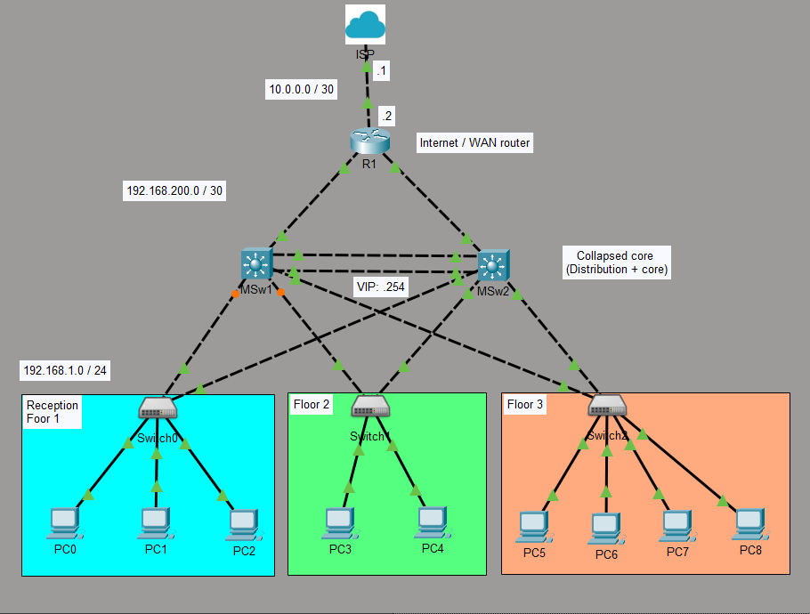

# Redundant Office Network Using STP & EtherChannel

## Overview

**Objective:**
Design a small office Network with redundancy using STP  EtherChannel & HSRP.

**Technologies Used:**

* collapsed core architecture
* EtherChannel
* STP (PVST+)
* HSRP
* Static IP addressing
* Static Routes
  
**Tools:**

* Cisco Packet Tracer 

---

## Topology



**Description:**
A small office network impemented using collapsed core achitecture in a small office with three floors. For redundancy, endhosts uses router's HSRP VIP address .1. 

---

## IP Addressing Scheme

| Device | Interface | IP Address   | Subnet Mask     | Notes   |
| ------ | --------- | ------------ | --------------- | ------- |
| ISP    |  G0/0/0   | 10.0.0.1     | 255.255.255.252 |         |
| ISP    |  L0       | 8.8.8.8      | 255.255.255.255 |         |
| R1     |  L0       | 1.1.1.1      | 255.255.255.255 |         |
| R1     |  G0/0/2   | 10.0.0.2     | 255.255.255.252 |         |
| R1     |  G0/0/1   |192.168.200.10| 255.255.255.224 |         |
| R1     |  G0/0/0   | 192.168.200.2| 255.255.255.252 |         |
| MSw1   |  L0       | 2.2.2.2      | 255.255.255.255 |         |
| MSw1   |  G1/7     | 192.168.200.1| 255.255.255.252 |         |
| MSw1   |  Po1      | 192.168.200.5| 255.255.255.252 |         |
| MSw1   |  vlan 1   | 192.168.1.253| 255.255.255.0   |         |
| MSw2   |  L0       | 3.3.3.3      | 255.255.255.255 |         |
| MSw2   |  G1/7     | 192.168.200.9| 255.255.255.252 |         |
| MSw2   |  Po1      | 192.168.200.6| 255.255.255.252 |         |
| MSw2   |  vlan 1   | 192.168.1.254| 255.255.255.0   |         |
| PC0    |  Fa0      | 192.168.1.1  | 255.255.255.224 |         |
| PC1    |  Fa0      | 192.168.1.2  | 255.255.255.224 |         |
| PC2    |  Fa0      | 192.168.1.3  | 255.255.255.224 |         |
| PC3    |  Fa0      | 192.168.1.4  | 255.255.255.224 |         |
| PC4    |  Fa0      | 192.168.1.5  | 255.255.255.224 |         |
| PC5    |  Fa0      | 192.168.1.6  | 255.255.255.224 |         |
| PC6    |  Fa0      | 192.168.1.7  | 255.255.255.224 |         |
| PC7    |  Fa0      | 192.168.1.8  | 255.255.255.224 |         |
| PC8    |  Fa0      | 192.168.1.9  | 255.255.255.224 |         |

---

## Configurations

### Router Configurations
1. Password protection (console, enable secret)
   - Console login local 
     - username: cisco
     - secret: ccna
   - Enable secret: ccna
2. Route configurations

```
ip route 0.0.0.0 0.0.0.0 GigabitEthernet0/0/2 
---Added in troubleshooting phase---
ip route 192.168.1.0 255.255.255.0 192.168.200.1 4
ip route 192.168.1.0 255.255.255.0 192.168.200.9
```


### Switch Configurations
1. Password protection (console, enable secret)
   - Console login local 
     - username: cisco
     - secret: ccna
   - Enable secret: ccna

2. VLAN 1 IP address (MSw1 & MSw2)
3. HSRP (MSw1 & MSw2)
4. ROute configurayions
```
ip route 0.0.0.0 0.0.0.0 GigabitEthernet1/7
```

---

## Config processes
1. Assign endhost static IP addresses
2. Configure appropriate names for network devices
3. Enable password protection on network devices
4. Enabled (PVST+) on swtches
5. Set MSw2 as Root Bridge
6. Assign Vlan 1 IP address on L3 SW
7. Configure HSRP on both switches (SW2 active & pre-emptive)
8. Configure Layer 3 etherchannel (LACP)
9. Assign IP addresses to all network devices (Etherchannel inclusive)
10. Configure static routes on SW (R1 as default route) and router
11. Configure default route to ISP on R1 


## Verification

**Commands Used:**
1. Verify endhost connectivity (e.g ping PC5 from PC1)
```
ping 192.168.1.6
```
2. HSRP
  - Disable all interfaces on MSw2 
```
ping 192.168.1.254
```
 - Ping should succeed 
 - Re-enable interfaces on Msw2 and ping 192.168.1.254 - Ping should reach MSw2


3. Verify endhosts connectivity with ISP

```
ping 8.8.8.8
```

**Expected Results:**
All PCs must be able to ping each other, reach ISP (8.8.8.8)

---

## Troubleshooting 

| Issue                 | Cause         | Fix                  |
| --------------------- | ------------- | -------------------- |
| Endhosts could not reach ISP 8.8.8.8 | R1 had default route to ISP but no route back to host subnet 192.168.1.0 /24 | Configured route to 192.168.1.0 /24 MSw1 as next hop with AD of 4 and MSw1 as next hop AD 1. The floating static route to MSw1 will allow traffic to be routed to MSw1 in the event that MSw2 fails. HSRP handles this failure for endhosts|

---

## Key Learning Outcomes

* Layer 3 Etherchannel configurations
* STP (PVST+)
* HSRP
* Static IP addressing
* Static Routes
---

## Files Included

| File            | Description           |
| --------------- | --------------------- |
| `Network-topology.png`  | Network diagram       |
| `description.md`| A description of the project requirements |
| `.pkt / `       | Lab file              |

---

## Author

**Hillary Mapondera**
Aspiring Network Engineer

GitHub: *[Hillary](https://github.com/Hillary1011)*

Linkedin: *[Hillary](https://www.linkedin.com/in/hillary-mapondera-7825b91a1/)*

---

## License


```
vlan-intervlan-routing/
  ├── Network-topology.png
  ├── project description.md
  ├── vlans & Intervlan routing.pkt
  ├── vlans & Intervlan routing - No configurations.pkt      
  └── README.md  
```
