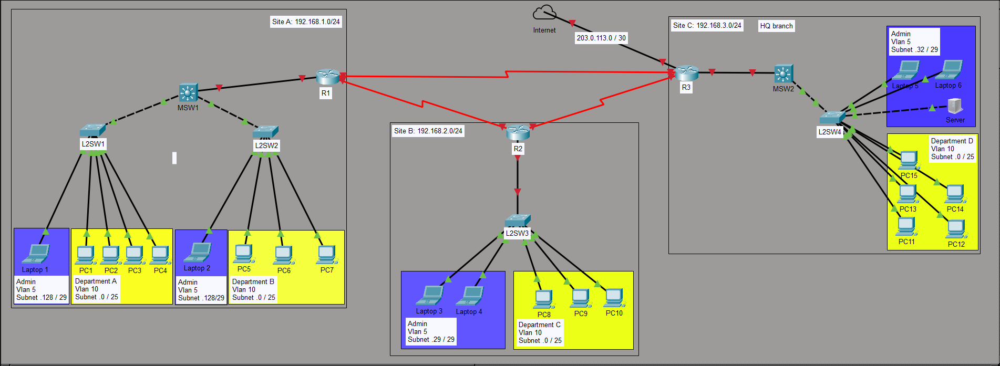

# Redundant Office Network Using STP & EtherChannel

## Overview

**Objective:**
Simulate a medium sized organization network with multiple branches using dynamic routing ensuring endhost get IP addresses dynamically and and able to reach the internet. Previleged Administrative devices on all sites must be able to reach the Internet through HQ router

**Technologies Used:**
* OSPF single area (Area 0)
* STP (PVST+)
* Dynamic IP addressing (DHCP)
* NAT
* 

**Tools:**

* Cisco Packet Tracer 

---

## Topology



**Description:**
A medium sized organization network with three sites using site-to-site direct links with HQ branch having direct access to the Internet. 

---

## Config processes
1. **Security**
   - Configure appropriate names for network devices
   - Configure console port security on network devices (login local)
   - Configure enable secret protection
2. **STP**
   - Enabled (Papid-PVST+) on swtches
   - Set MSW1 as Root Bridge
3. **VLAN configuration**
   - Assign appropriate VLANs for Adminstation and Department end devices
   - Configure appropriate trunk ports on L2 and L3 swicthes excluding L2SW3
4. **Dynamic IP addressing (DHCP)**
   - On MSW1 and MSW3 
     - Configure IP routing on MSW1 and DHCP server.
     - Configure SVIs for each VLAN (SVI becomes Gateway for the subnet).
     - Configure DHCP Server on MSW1 and MSW3 
   - On R2 - L2SW3
     - Configure Router on a stick (subinterfaces on R2, Trunk on L2SW3)
     - Configure DHCP Server on R2
5. **Configure Static IP address on routers and L3 Switches**
  
6. **Dynamic routing (OSPF)**
   - Configure OSPF area 0 on all L3 devices 
   - Configure passive interfaces where necessary (SVIs, Loopbacks, interfaces towards endhosts) 
   - Set R3 to have a default route to ISP.
7. **Internet access restriction on Department (ACL)** 
   - [Continue here Ensure DHCP is such that Organizations server is the DNS, this requires to manually set its IP address and reserve its IP address in its local subnet pool, as well re configuring DNS on all subnets to use the server.]
   - 
8. **NAT**
9.  Configure HSRP on both switches (SW2 active & pre-emptive)
10. Configure Layer 3 etherchannel (LACP)
11. Assign IP addresses to all network devices (Etherchannel inclusive)
12. Configure static routes on SW (R1 as default route) and router
13. Configure default route to ISP on R1 

## Verification

1. Config processes step 4 `Dynamic IP addressing (DHCP)` 
   - ✅ Confirm endhosts get IP addresses in the expected subnets
   - ✅ Confirm local devices can ping each other 
2. Config processes step 5 `Configure Static IP address on routers and L3 Switches`
   - ✅ Confirm network devices on point-to-point links can ping each other
3. Config processes step 6 `Dynamic routing (OSPF)` 
   - Confirm IP address learning
   - Confirm endhosts can reach 1.1.1.1 (ISP)
4. 


## IP Addressing Scheme

| Device | Interface | IP Address   | Subnet Mask     | Notes   |
| ------ | --------- | ------------ | --------------- | ------- |
| ISP    |  G0/0/0   | 10.0.0.1     | 255.255.255.252 |         |
| ISP    |  L0       | 8.8.8.8      | 255.255.255.255 |         |
| R1     |  L0       | 1.1.1.1      | 255.255.255.255 |         |
| R1     |  G0/0/2   | 10.0.0.2     | 255.255.255.252 |         |
| R1     |  G0/0/1   |192.168.200.10| 255.255.255.224 |         |
| R1     |  G0/0/0   | 192.168.200.2| 255.255.255.252 |         |
| MSw1   |  L0       | 2.2.2.2      | 255.255.255.255 |         |
| MSw1   |  G1/7     | 192.168.200.1| 255.255.255.252 |         |
| MSw1   |  Po1      | 192.168.200.5| 255.255.255.252 |         |
| MSw1   |  vlan 1   | 192.168.1.253| 255.255.255.0   |         |
| MSw2   |  L0       | 3.3.3.3      | 255.255.255.255 |         |
| MSw2   |  G1/7     | 192.168.200.9| 255.255.255.252 |         |
| MSw2   |  Po1      | 192.168.200.6| 255.255.255.252 |         |
| MSw2   |  vlan 1   | 192.168.1.254| 255.255.255.0   |         |
| PC0    |  Fa0      | 192.168.1.1  | 255.255.255.224 |         |
| PC1    |  Fa0      | 192.168.1.2  | 255.255.255.224 |         |
| PC2    |  Fa0      | 192.168.1.3  | 255.255.255.224 |         |
| PC3    |  Fa0      | 192.168.1.4  | 255.255.255.224 |         |
| PC4    |  Fa0      | 192.168.1.5  | 255.255.255.224 |         |
| PC5    |  Fa0      | 192.168.1.6  | 255.255.255.224 |         |
| PC6    |  Fa0      | 192.168.1.7  | 255.255.255.224 |         |
| PC7    |  Fa0      | 192.168.1.8  | 255.255.255.224 |         |
| PC8    |  Fa0      | 192.168.1.9  | 255.255.255.224 |         |

---

## Configurations

### Router Configurations
1. Password protection (console, enable secret)
   - Console login local 
     - username: cisco
     - secret: ccna
   - Enable secret: ccna
2. Route configurations

```
ip route 0.0.0.0 0.0.0.0 GigabitEthernet0/0/2 
---Added in troubleshooting phase---
ip route 192.168.1.0 255.255.255.0 192.168.200.1 4
ip route 192.168.1.0 255.255.255.0 192.168.200.9
```


### Switch Configurations
1. Password protection (console, enable secret)
   - Console login local 
     - username: cisco
     - secret: ccna
   - Enable secret: ccna

2. VLAN 1 IP address (MSw1 & MSw2)
3. HSRP (MSw1 & MSw2)
4. ROute configurayions
```
ip route 0.0.0.0 0.0.0.0 GigabitEthernet1/7
```

---

## Config processes
1. Assign endhost static IP addresses
2. Configure appropriate names for network devices
3. Enable password protection on network devices
4. Enabled (PVST+) on swtches
5. Set MSw2 as Root Bridge
6. Assign Vlan 1 IP address on L3 SW
7. Configure HSRP on both switches (SW2 active & pre-emptive)
8. Configure Layer 3 etherchannel (LACP)
9. Assign IP addresses to all network devices (Etherchannel inclusive)
10. Configure static routes on SW (R1 as default route) and router
11. Configure default route to ISP on R1 


**Expected Results:**
All PCs must be able to ping each other, reach ISP (8.8.8.8)

---

## Troubleshooting 

| Issue                 | Cause         | Fix                  |
| --------------------- | ------------- | -------------------- |
| Endhosts could not reach ISP 8.8.8.8 | R1 had default route to ISP but no route back to host subnet 192.168.1.0 /24 | Configured route to 192.168.1.0 /24 MSw1 as next hop with AD of 4 and MSw1 as next hop AD 1. The floating static route to MSw1 will allow traffic to be routed to MSw1 in the event that MSw2 fails. HSRP handles this failure for endhosts|

---

## Key Learning Outcomes

* Layer 3 Etherchannel configurations
* STP (PVST+)
* HSRP
* Static IP addressing
* Static Routes
---

## Files Included

| File            | Description           |
| --------------- | --------------------- |
| `Network-topology.png`  | Network diagram       |
| `description.md`| A description of the project requirements |
| `.pkt / `       | Lab file              |

---

## Author

**Hillary Mapondera**
Aspiring Network Engineer

GitHub: *[Hillary](https://github.com/Hillary1011)*

Linkedin: *[Hillary](https://www.linkedin.com/in/hillary-mapondera-7825b91a1/)*

---

## License


```
vlan-intervlan-routing/
  ├── Network-topology.png
  ├── project description.md
  ├── vlans & Intervlan routing.pkt
  ├── vlans & Intervlan routing - No configurations.pkt      
  └── README.md  
```
