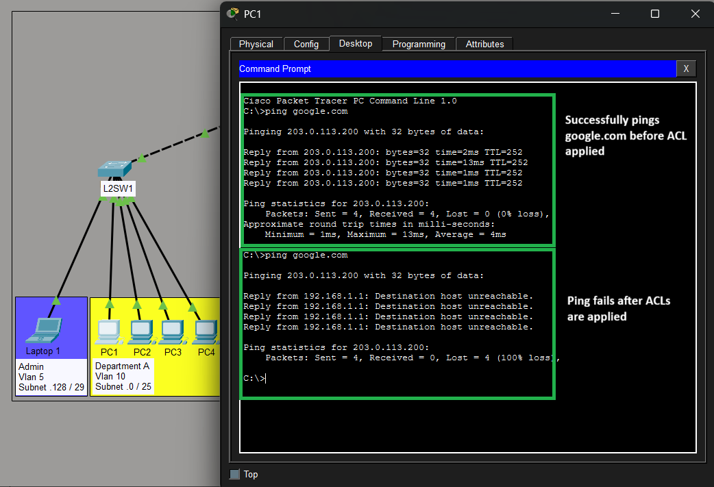
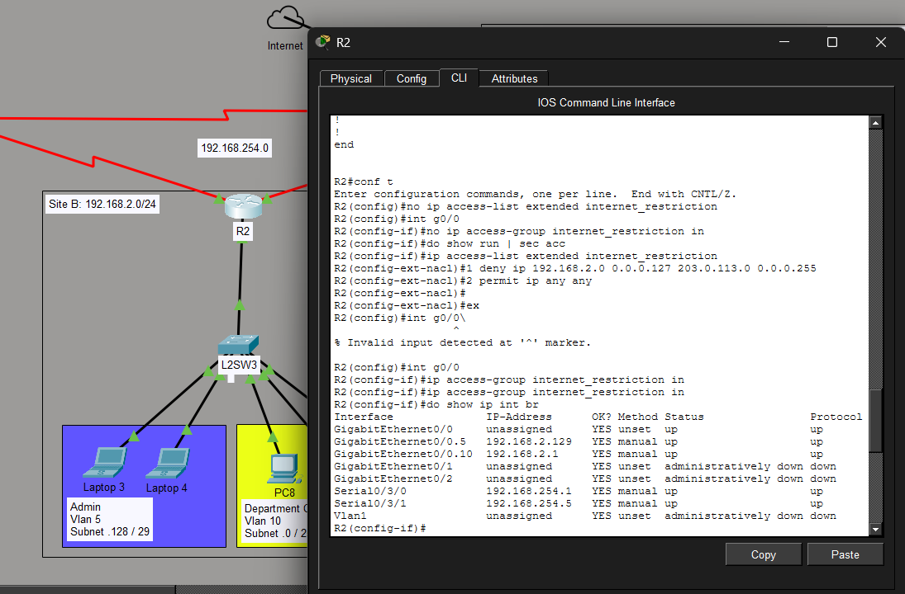
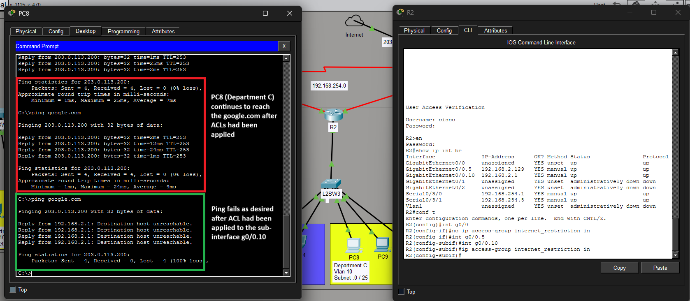

# Redundant Office Network Using STP & EtherChannel

## Overview

**Objective:**
Simulate a medium sized organization network with multiple branches using dynamic routing ensuring endhost get IP addresses dynamically and and able to reach the internet. Previleged Administrative devices on all sites must be able to reach the Internet through HQ router

**Technologies Used:**
* OSPF single area (Area 0)
* STP (PVST+)
* Dynamic IP addressing (DHCP)
* ACL
* IP

**Tools:**

* Cisco Packet Tracer 

---

## Topology


**Description:**
A medium sized organization network with three sites using site-to-site direct links with HQ branch having direct access to the Internet. 

---

## Config processes
1. **Security**
   - Configure appropriate names for network devices
   - Configure console port security on network devices (login local)
   - Configure enable secret protection
2. **STP**
   - Enable (Papid-PVST+) on switches
   - Set MSW1 as Root Bridge
3. **VLAN configuration**
   - Assign appropriate VLANs for Adminstation and Department end devices
   - Configure appropriate trunk ports on L2 and L3 swicthes excluding L2SW3
4. **Dynamic IP addressing (DHCP)**
   - Set a static IP address on the server as `192.168.3.130`(This becomes the DNS server IP on all branches). 
   - Manually setup the default gateway on server as `192.168.3.129`
   - On MSW1 and MSW3   
     - Configure IP routing on MSW1 and DHCP server.
     - Configure SVIs for each VLAN (SVI becomes Gateway for the subnet).
     - Configure DHCP Server on MSW1 and MSW3 
   - On R2 - L2SW3
     - Configure Router on a stick (subinterfaces on R2, Trunk on L2SW3)
     - Configure DHCP Server on R2
5. **Configure Static IP address on routers and L3 Switches**
  
6. **Dynamic routing (OSPF)**
   - Configure OSPF area 0 on all L3 devices 
   - Configure passive interfaces where necessary (SVIs, Loopbacks, interfaces towards endhosts) 
   - Set R3 to have a default route to ISP.

7. **DNS**
   - Configure DNS AAA records on the server, Google `203.0.113.200`, Youtube `203.0.113.201`. 
  
8. **Internet access restriction on non-admin hosts (ACL)** 
   - Configure extended ACLs on appropriate devices (MSw1, R2, MSW2).
 

## Verification

1. Config processes step 4 `Dynamic IP addressing (DHCP)` 
   - ✅ Confirm endhosts get IP addresses in the expected subnets
   - ✅ Confirm local devices can ping each other 
2. Config processes step 5 `Configure Static IP address on routers and L3 Switches`
   - ✅ Confirm network devices on point-to-point links can ping each other
3. Config processes step 6 `Dynamic routing (OSPF)` 
   - ✅ Confirm IP address learning
   - ✅ Confirm endhosts can reach 1.1.1.1 (ISP)
4. Config processes step 7 `DNS` 
   - ✅ Verify endhosts (Admin PCs, Department PCs) can ping google.com
   
5. Config processes step 8 `ACL configuration`
   - ✅ Verify Admin PCs reach google.com
   - ✅ Verify Department PCs cannot reach google.com


---

## Troubleshooting 

| Issue                 | Cause         | Fix                  |  Note     |
| --------------------- | ------------- | -------------------- | ---------|
| Config 8: Department PCs in site B could still reach internet after ACL configuration | R2's G0/0 interface was configured with subinterfaces with the intent of establishing router on a stick. When configuring the ACL the interface g0/0 was used using command `ip access-group {ACL-name} in`. *Assumption:* (The ACL could not capture the traffic in the sub-interfaces) | Applied the ACL on subinterface g0/0.10 which is in the same vlan as the department endhosts| A similar issue would occure on Site C MSW2 if command `ip access-group {ACL-name} in` is used on f0/2 since it is a trunkport and SVIs configured for each of the Vlans. The solution is to apply the ACL on F0/1 as `output`|

**Issue config 8:**

**Fix config 8:**


---

## IP Addressing Scheme

| Device | Interface | IP Address   | Subnet Mask     | Notes   |
| ------ | --------- | ------------ | --------------- | ------- |
| R1     |  G0/0     |192.168.1.254 | 255.255.255.252 |         |
| R1     |  S0/3/0   | 192.168.254.9| 255.255.255.252 |         |
| R1     |  S0/3/1   | 192.168.254.6| 255.255.255.252 |         |
| R2     |  G0/0.5   | 192.168.2.129| 255.255.255.248 |         |
| R2     |  G0/0.10  | 192.168.2.1  | 255.255.255.248 |         |
| R2     |  S0/3/0   | 192.168.254.1| 255.255.255.252 |         |
| R2     |  S0/3/0   | 192.168.254.5| 255.255.255.252 |         |
| R3     |  G0/0     | 192.168.3.254| 255.255.255.252 |         |
| R3     |  G0/2     | 203.0.113.2  | 255.255.255.252 |         |
| R3     |  S0/3/0   | 192.168.254.2| 255.255.255.252 |         |
| R3     |  S0/3/1   |192.168.254.10| 255.255.255.252 |         |
| MSw1   |  F0/3     | 192.168.1.253| 255.255.255.252 |         |
| MSw1   |  VLAN 5   | 192.168.1.129| 255.255.255.248 |         |
| MSw1   |  Vlan 10  | 192.168.1.1  | 255.255.255.128 |         |
| MSw2   |  F0/1     | 192.168.3.253| 255.255.255.252 |         |
| MSW2   |  VLAN 5   | 192.168.3.129| 255.255.255.248 |         |
| MSW2   |  VLAN 10  | 192.168.3.1  | 255.255.255.128 |         |
| Server |  Fa0      | 192.168.3.130| 255.255.255.248 |         |
| Admin  |  Fa0      | DHCP         | 255.255.255.248 |         |
| Depart |  Fa0      | DHCP         | 255.255.255.128 |         |


## Key Learning Outcomes

* Vlan Configurations
* STP (PVST+)
* Dynamic IP address assignment
* Static IP addressing
* Dynamic routing
* Use of ACL to control network access
* Sub-interface based configuration of ACLs on interfaces forming router on a stick
  
---

## Main Files

| File            | Description           |
| --------------- | --------------------- |
| `Network-topology.png`  | Network diagram       |
| `description.md`| A description of the project requirements |
| `.pkt / `       | Lab file              |

---

## Author

**Hillary Mapondera**
Aspiring Network Engineer

GitHub: *[Hillary](https://github.com/Hillary1011)*

Linkedin: *[Hillary](https://www.linkedin.com/in/hillary-mapondera-7825b91a1/)*

---

## License


**Project file structure**

```
Multi-Site Network with OSPF/
  ├── Mutisite network with OSPF.pkt 
  ├── Mutisite network with OSPF - No configurations.pkt
  ├── project description.md
  ├── README.md  
  ├── Network-topology.png  
  ├── ACL-verification.png
  ├── ACL-R2-Troubleshoot.png   
  └── ACL-R2-Fix.png
```
