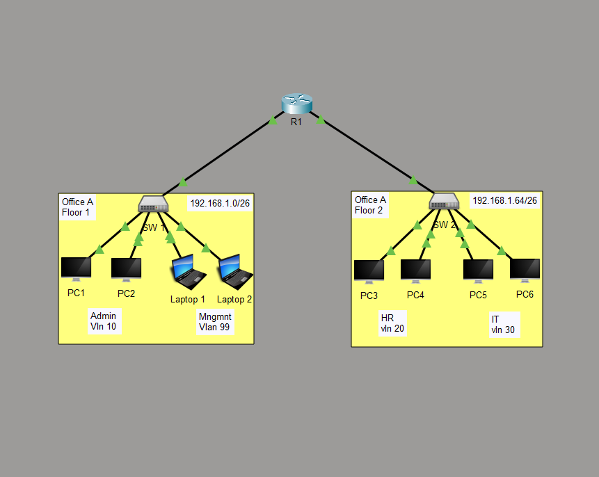

# Small Office Network with VLANs & Inter-VLAN Routing

## Overview

**Objective:**
Design a scalable small office LAN using VLAN segmentation and router-on-a-stick.

**Technologies Used:**

* VLAN
* Inter-VLAN Routing
  
**Tools:**

* Cisco Packet Tracer 

---

## Topology



**Description:**
A simple small office network 

---
## Subnets

Two subnets have been setup each for floor 1 and floor 2.

Floor 1: 192.168.1.0/26 - host range(1 - 62)
  
- Two subnets for each vlan for network 192.168.1.0 /27
  - Admin subnet: (1 - 30)
  - Mgmt subnet: (33 - 62)

Floor 2: 192.168.1.64/26 - host range(65 - 126)
- Two subnets for each vlan for network 192.168.1.0 /27
  - HR subnet: (65 - 94)
  - IT subnet: (97 - 126)


Reserved usable ip address /26: (129 - 190), (193 - 254)

---

## IP Addressing Scheme

| Device | Interface | IP Address   | Subnet Mask     | Notes   |
| ------ | --------- | ------------ | --------------- | ------- |
| R0     | G0/0/0    |              |                 | Not in use   |
| R1     | G0/0/0.10 | 192.168.1.30  | 255.255.255.224| Admin VLAN 10|
| R1     | G0/0/0.99 | 192.168.1.62  | 255.255.255.224| Mgmt  VLAN 99|
| PC1    |  Fa0      | 192.168.1.1  | 255.255.255.224 | Admin VLAN 10|
| PC2    |  Fa0      | 192.168.1.2  | 255.255.255.224 | Admin VLAN 10|
| Laptop1|  Fa0      | 192.168.1.33 | 255.255.255.224 | Mgmt VLAN 99 |
| Laptop2|  Fa0      | 192.168.1.34 | 255.255.255.224 | Mgmt VLAN 99 |
| PC3    |  Fa0      | 192.168.1.65 | 255.255.255.224 | HR VLAN 20 |
| PC4    |  Fa0      | 192.168.1.66 | 255.255.255.224 | HR VLAN 20 |
| PC5    |  Fa0      | 192.168.1.97 | 255.255.255.224 | IT VLAN 30 |
| PC6    |  Fa0      | 192.168.1.98 | 255.255.255.224 | IT VLAN 30 |
---

## Configurations

### Router Configurations
1. Password protection (console, enable secret)
   - Console login local 
     - username: cisco
     - secret: ccna
   - Enable secret: ccna
2. Sub-interface configurations


### Switch Configurations
1. Password protection (console, enable secret)
   - Console login local 
     - username: cisco
     - secret: ccna
   - Enable secret: ccna
2. Vlan configuration (Vlan 10, 20, 30, 99)
3. Trunk port to enable (for ROAS)


---

## Verification

**Commands Used:**
1. Verify vlan configurations and trunk 
```
show vlan brief
show interfaces trunk
```
2. Inter VLAN routing in floor 1 (ping Laptop 1 from PC1)

```
ping 192.168.1.33 
```
2. Inter VLAN routing in floor 2 (ping PC5 from PC4)

```
ping 192.168.1.97
```

**Expected Results:**
All PCs must be able to ping each other.

---

## Troubleshooting 

| Issue                 | Cause         | Fix                  |
| --------------------- | ------------- | -------------------- |
| --- | --- | --- |

---

## Key Learning Outcomes

* Router on a Stick implementation
* VLAN configurations 
---

## Files Included

| File            | Description           |
| --------------- | --------------------- |
| `topology.png`  | Network diagram       |
| `description.md`| A description of the project requirements |
| `.pkt / `       | Lab file              |

---

## Author

**Hillary Mapondera**
Aspiring Network Engineer

GitHub: *[Hillary](https://github.com/Hillary1011)*

Linkedin: *[Hillary](https://www.linkedin.com/in/hillary-mapondera-7825b91a1/)*

---

## License


```
vlan-intervlan-routing/
    ├── Network-topology.png
    ├── project description.md
    ├── vlans & Intervlan routing.pkt   
    |   
    └── README.md  
```
